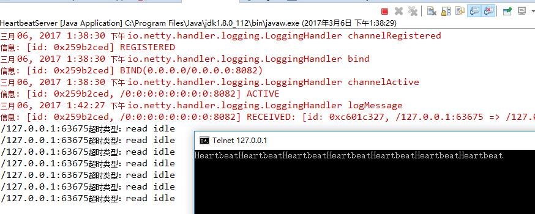

本文介绍了 Netty 超时机制的原理，以及如何在连接闲置时发送一个心跳来维持连接。

<!-- more -->

## Netty 超时机制的介绍

Netty 的超时类型 [IdleState](http://netty.io/4.0/api/io/netty/handler/timeout/IdleState.html) 主要分为：

* ALL_IDLE : 一段时间内没有数据接收或者发送
* READER_IDLE ： 一段时间内没有数据接收
* WRITER_IDLE ： 一段时间内没有数据发送

在 Netty 的 [timeout](http://netty.io/4.0/api/io/netty/handler/timeout/package-frame.html) 包下，主要类有：

* IdleStateEvent ： 超时的事件
* IdleStateHandler ： 超时状态处理
* ReadTimeoutHandler ： 读超时状态处理
* WriteTimeoutHandler ： 写超时状态处理
 
其中 IdleStateHandler 包含了读\写超时状态处理，比如

```java
private static final int READ_IDEL_TIME_OUT = 4; // 读超时
private static final int WRITE_IDEL_TIME_OUT = 5;// 写超时
private static final int ALL_IDEL_TIME_OUT = 7; // 所有超时

new IdleStateHandler(READ_IDEL_TIME_OUT,
			WRITE_IDEL_TIME_OUT, ALL_IDEL_TIME_OUT, TimeUnit.SECONDS));	
```

上述例子，在 IdleStateHandler 中定义了读超时的时间是 4 秒， 写超时的时间是 5 秒，其他所有的超时时间是 7 秒。

## 应用 IdleStateHandler

既然 IdleStateHandler 包括了读\写超时状态处理，那么很多时候 ReadTimeoutHandler 、 WriteTimeoutHandler 都可以不用使用。定义另一个名为 HeartbeatHandlerInitializer 的 ChannelInitializer ：

```java
public class HeartbeatHandlerInitializer extends ChannelInitializer<Channel> {

	private static final int READ_IDEL_TIME_OUT = 4; // 读超时
	private static final int WRITE_IDEL_TIME_OUT = 5;// 写超时
	private static final int ALL_IDEL_TIME_OUT = 7; // 所有超时

	@Override
	protected void initChannel(Channel ch) throws Exception {
		ChannelPipeline pipeline = ch.pipeline();
		pipeline.addLast(new IdleStateHandler(READ_IDEL_TIME_OUT,
				WRITE_IDEL_TIME_OUT, ALL_IDEL_TIME_OUT, TimeUnit.SECONDS)); // 1
		pipeline.addLast(new HeartbeatServerHandler()); // 2
	}
}
```

1. 使用了 IdleStateHandler ，分别设置了读、写超时的时间
2. 定义了一个 HeartbeatServerHandler 处理器，用来处理超时时，发送心跳

## 定义了一个心跳处理器

```java
public class HeartbeatServerHandler extends ChannelInboundHandlerAdapter {
	
	// Return a unreleasable view on the given ByteBuf
	// which will just ignore release and retain calls.
	private static final ByteBuf HEARTBEAT_SEQUENCE = Unpooled
			.unreleasableBuffer(Unpooled.copiedBuffer("Heartbeat",
					CharsetUtil.UTF_8));  // 1

	@Override
	public void userEventTriggered(ChannelHandlerContext ctx, Object evt)
			throws Exception {

		if (evt instanceof IdleStateEvent) {  // 2
			IdleStateEvent event = (IdleStateEvent) evt;  
			String type = "";
			if (event.state() == IdleState.READER_IDLE) {
				type = "read idle";
			} else if (event.state() == IdleState.WRITER_IDLE) {
				type = "write idle";
			} else if (event.state() == IdleState.ALL_IDLE) {
				type = "all idle";
			}

			ctx.writeAndFlush(HEARTBEAT_SEQUENCE.duplicate()).addListener(
					ChannelFutureListener.CLOSE_ON_FAILURE);  // 3
 
			System.out.println( ctx.channel().remoteAddress()+"超时类型：" + type);
		} else {
			super.userEventTriggered(ctx, evt);
		}
	}
}
```

1. 定义了心跳时，要发送的内容
2. 判断是否是 IdleStateEvent 事件，是则处理
3. 将心跳内容发送给客户端

## 服务器

服务器代码比较简单，启动后侦听 8082 端口

```java
public final class HeartbeatServer {

    static final int PORT = 8082;

    public static void main(String[] args) throws Exception {

        // Configure the server.
        EventLoopGroup bossGroup = new NioEventLoopGroup(1);
        EventLoopGroup workerGroup = new NioEventLoopGroup();
        try {
            ServerBootstrap b = new ServerBootstrap();
            b.group(bossGroup, workerGroup)
             .channel(NioServerSocketChannel.class)
             .option(ChannelOption.SO_BACKLOG, 100)
             .handler(new LoggingHandler(LogLevel.INFO))
             .childHandler(new HeartbeatHandlerInitializer());

            // Start the server.
            ChannelFuture f = b.bind(PORT).sync();

            // Wait until the server socket is closed.
            f.channel().closeFuture().sync();
        } finally {
            // Shut down all event loops to terminate all threads.
            bossGroup.shutdownGracefully();
            workerGroup.shutdownGracefully();
        }
    }
}
```


## 客户端测试

客户端用操作系统自带的 Telnet 程序即可：

	telnet 127.0.0.1 8082

## 效果




## 源码

见 <https://github.com/waylau/netty-4-user-guide-demos> 中 `heartbeat`包

## 参考

* Netty 4.x 用户指南 <https://github.com/waylau/netty-4-user-guide>
* Netty 实战(精髓) <https://github.com/waylau/essential-netty-in-action>
