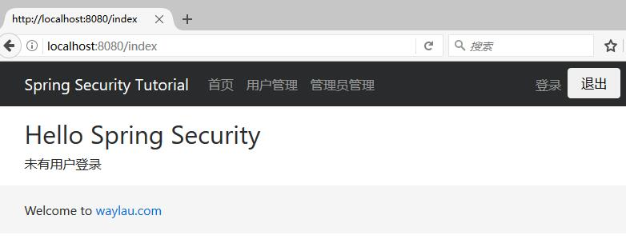
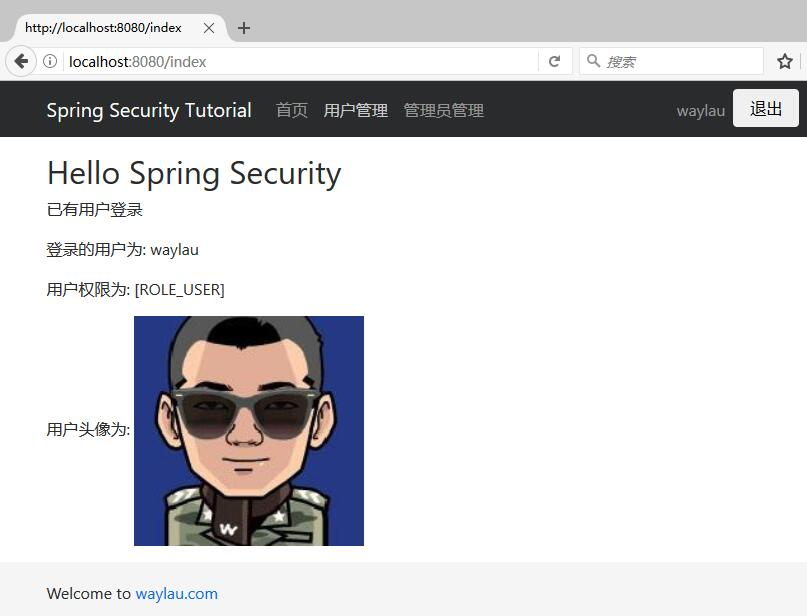
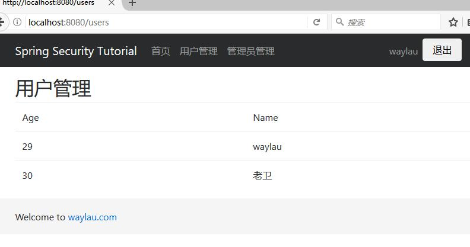
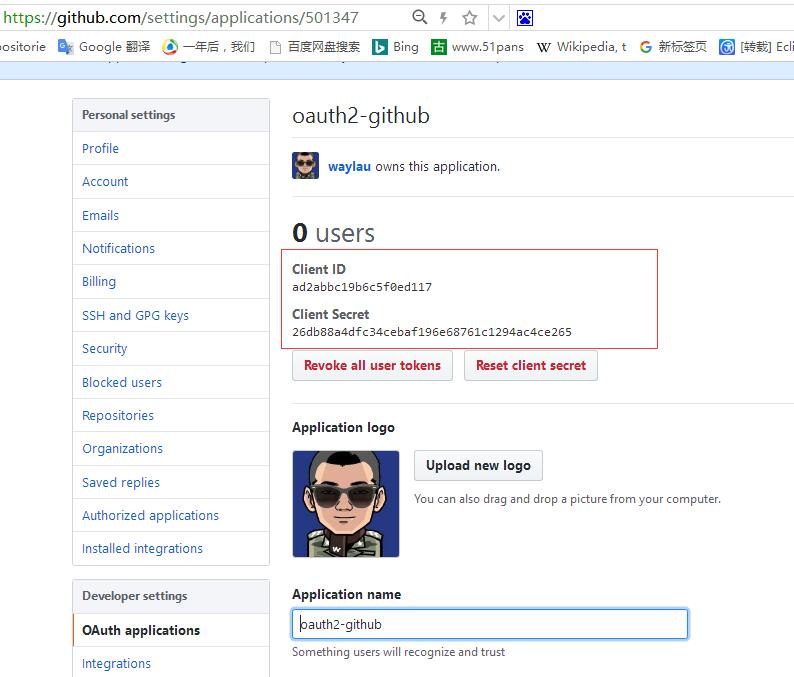
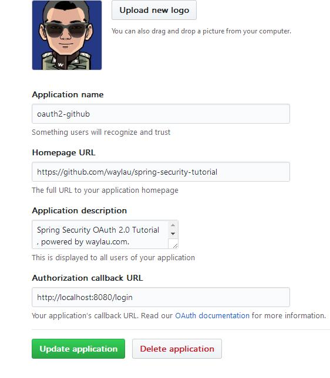

使用 OAuth 2.0 认证的的好处是显然易见的。你只需要用同一个账号密码，就能在各个网站进行访问，而免去了在每个网站都进行注册的繁琐过程。
本文将介绍 OAuth 2.0 的原理，并基于 Spring Security 和  GitHub 账号，来演示 OAuth 2.0 的认证的过程。

<!-- more -->

## 什么是 OAuth 2.0

OAuth 2.0 的规范可以参考 RFC 6749（<http://tools.ietf.org/html/rfc6749>）。

OAuth 是一个开放标准，允许用户让第三方应用访问该用户在某一网站上存储的私密的资源（如照片、视频、联系人列表等），而无需将用户名和密码提供给第三方应用。目前，OAuth 的最新版本为 2.0。

OAuth 允许用户提供一个令牌，而不是用户名和密码来访问他们存放在特定服务提供者的数据。每一个令牌授权一个特定的网站（例如，视频编辑网站)在特定的时段（例如，接下来的2小时内）内访问特定的资源（例如仅仅是某一相册中的视频）。这样，OAuth 允许用户授权第三方网站访问他们存储在另外的服务提供者上的信息，而不需要分享他们的访问许可或他们数据的所有内容。

## OAuth 2.0 的核心概念

OAuth 2.0 主要有4类角色：

* resource owner：资源所有者，指终端的“用户”（user）。
* resource server：资源服务器，即服务提供商存放受保护资源。访问这些资源，需要获得访问令牌（access token）。它与认证服务器，可以是同一台服务器，也可以是不同的服务器。如果，我们访问新浪博客网站，那么如果使用新浪博客的账号来登录新浪博客网站，那么新浪博客的资源和新浪博客的认证都是同一家，可以认为是同一个服务器。如果，我们是新浪博客账号去登录了知乎，那么显然知乎的资源和新浪的认证不是一个服务器。
* client：客户端，代表向受保护资源进行资源请求的第三方应用程序。
* authorization server： 授权服务器， 在验证资源所有者并获得授权成功后，将发放访问令牌给客户端。

## OAuth 2.0 的认证流程

认证流程如下：

```
 +--------+                               +---------------+
 |        |--(A)- Authorization Request ->|   Resource    |
 |        |                               |     Owner     |
 |        |<-(B)-- Authorization Grant ---|               |
 |        |                               +---------------+
 |        |
 |        |                               +---------------+
 |        |--(C)-- Authorization Grant -->| Authorization |
 | Client |                               |     Server    |
 |        |<-(D)----- Access Token -------|               |
 |        |                               +---------------+
 |        |
 |        |                               +---------------+
 |        |--(E)----- Access Token ------>|    Resource   |
 |        |                               |     Server    |
 |        |<-(F)--- Protected Resource ---|               |
 +--------+                               +---------------+
```

* （A）用户打开客户端以后，客户端请求资源所有者（用户）的授权。
* （B）用户同意给予客户端授权。
* （C）客户端使用上一步获得的授权，向认证服务器申请访问令牌。
* （D）认证服务器对客户端进行认证以后，确认无误，同意发放访问令牌。
* （E）客户端使用访问令牌，向资源服务器申请获取资源。
* （F）资源服务器确认令牌无误，同意向客户端开放资源。

其中，用户授权有四种模式：

* 授权码模式（authorization code）
* 简化模式（implicit）
* 密码模式（resource owner password credentials）
* 客户端模式（client credentials）


## 实践  OAuth 2.0

Talk is cheap！下面将演示代码。
本例子将通过 Gradle、Spring Boot、Spring Security、 Thymeleaf、等技术来实现一个client 以及 resource server，并 通过 GitHub来给我们的应用授权。


### 依赖

本项目基于Gralde 来管理依赖，读者可以自行改成 Maven 的方式：


```
	// 该依赖对于编译发行是必须的
	compile('org.springframework.boot:spring-boot-starter-web')
 
	// 添加 Thymeleaf 的依赖
	compile('org.springframework.boot:spring-boot-starter-thymeleaf')

	// 添加  Spring Security 依赖
	compile('org.springframework.boot:spring-boot-starter-security')

	// 添加   Thymeleaf Spring Security 依赖，与 Thymeleaf 版本一致都是 3.x
	compile('org.thymeleaf.extras:thymeleaf-extras-springsecurity4:3.0.2.RELEASE')
	
	// 添加 Spring Security OAuth2 依赖
	compile('org.springframework.security.oauth:spring-security-oauth2:2.1.0.RELEASE')
 
	// 该依赖对于编译测试是必须的，默认包含编译产品依赖和编译时依
	testCompile('org.springframework.boot:spring-boot-starter-test')

	// 添加 Spring Security Test 依赖
	testCompile('org.springframework.security:spring-security-test:4.2.2.RELEASE')
```

### 配置


项目的核心配置如下：

```
github.client.clientId=ad2abbc19b6c5f0ed117
github.client.clientSecret=26db88a4dfc34cebaf196e68761c1294ac4ce265
github.client.accessTokenUri=https://github.com/login/oauth/access_token
github.client.userAuthorizationUri=https://github.com/login/oauth/authorize
github.client.clientAuthenticationScheme=form
github.client.tokenName=oauth_token
github.client.authenticationScheme=query
github.resource.userInfoUri=https://api.github.com/user
```

包括了作为一个client 所需要大部分参数。其中 clientId 、 clientSecret 是在 GitHub　注册一个应用时生成的。如果读者不想注册应用，则可以直接用上面的配置即可。
如果要注册，则文章最后有注册流程。


### 项目安全的配置

安全配置上需要加上`@EnableWebSecurity` 、 `@EnableOAuth2Client`注解，来启用 Web 安全认证机制，并表明这是一个OAuth 2.0 客户端 。 `@EnableGlobalMethodSecurity`注明，项目采用了基于方法的安全设置 ：

```
@EnableWebSecurity
@EnableOAuth2Client  // 启用 OAuth 2.0 客户端 
@EnableGlobalMethodSecurity(prePostEnabled = true) // 启用方法安全设置
public class SecurityConfig extends WebSecurityConfigurerAdapter {
```

使用 Spring Security，我们需要继承 `org.springframework.security.config.annotation.web.configuration.WebSecurityConfigurerAdapter`并重写以下 configure 方法：


```
@Override
protected void configure(HttpSecurity http) throws Exception {
    http.addFilterBefore(ssoFilter(), BasicAuthenticationFilter.class)
        .antMatcher("/**")
        .authorizeRequests()
        .antMatchers("/", "/index", "/403","/css/**", "/js/**", "/fonts/**").permitAll() // 不设限制，都允许访问
        .anyRequest()
        .authenticated()
        .and().logout().logoutSuccessUrl("/").permitAll()
        .and().csrf().csrfTokenRepository(CookieCsrfTokenRepository.withHttpOnlyFalse())
    ;
}
```

上面的配置是设置了一些过过滤策略，除了静态资源以及不需要授权的页面，我们允许访问，其他的资源，都是需要授权访问。

其中，我们也设置了一个过滤器 ssoFilter，用于在 BasicAuthenticationFilter 之前进行拦截。如果拦截道的是`/login`，就是访问认证服务器。
```
private Filter ssoFilter() {
    OAuth2ClientAuthenticationProcessingFilter githubFilter = new OAuth2ClientAuthenticationProcessingFilter("/login");
    OAuth2RestTemplate githubTemplate = new OAuth2RestTemplate(github(), oauth2ClientContext);
    githubFilter.setRestTemplate(githubTemplate);
    UserInfoTokenServices tokenServices = new UserInfoTokenServices(githubResource().getUserInfoUri(), github().getClientId());
    tokenServices.setRestTemplate(githubTemplate);
    githubFilter.setTokenServices(tokenServices);
    return githubFilter;

}

@Bean
public FilterRegistrationBean oauth2ClientFilterRegistration(
        OAuth2ClientContextFilter filter) {
    FilterRegistrationBean registration = new FilterRegistrationBean();
    registration.setFilter(filter);
    registration.setOrder(-100);
    return registration;
}

@Bean
@ConfigurationProperties("github.client")
public AuthorizationCodeResourceDetails github() {
    return new AuthorizationCodeResourceDetails();
}

@Bean
@ConfigurationProperties("github.resource")
public ResourceServerProperties githubResource() {
    return new ResourceServerProperties();
}
```

### 资源服务器

我们写了两个控制器来提供相应的资源。

MainController.java

```java
@Controller
public class MainController {
	
	@GetMapping("/")
	public String root() {
		return "redirect:/index";
	}
	
	@GetMapping("/index")
	public String index(Principal principal, Model model) {
	    if(principal == null ){
	    	return "index";
	    }
		System.out.println(principal.toString());
		model.addAttribute("principal", principal);
		return "index";
	}

	@GetMapping("/403")
	public String accesssDenied() {
		return "403";
	}
}
```

在index 页面，将如认证成功，将会显示一些认证信息。

UserController.java  是用来模拟用户管理的相关资源。

```java
@RestController
@RequestMapping("/")
public class UserController {
	/**
	 * 查询所用用户
	 * @return
	 */
	@GetMapping("/users")
	@PreAuthorize("hasAuthority('ROLE_USER')")  // 指定角色权限才能操作方法
	public ModelAndView list(Model model) {

		List<User> list = new ArrayList<>();	// 当前所在页面数据列表
		list.add(new User("waylau",29));
		list.add(new User("老卫",30));
		model.addAttribute("title", "用户管理");
		model.addAttribute("userList", list);
		return new ModelAndView("users/list", "userModel", model);
	}

}
```
### 前端页面

页面，我主要是采用 Thymeleaf 以及Bootstrap 来编写的。

首页用于现实用户的基本信息。

```
<body>
	<div class="container">
      	<div class="mt-3">
        	<h2>Hello Spring Security</h2>
        </div>
		<div sec:authorize="isAuthenticated()" th:if="${principal}" th:object="${principal}">
			<p>已有用户登录</p>
			<p>登录的用户为: <span sec:authentication="name"></span></p>
			<p>用户权限为: <span th:text="*{userAuthentication.authorities}"></span></p>
 			<p>用户头像为: </p>
 			
		</div>
 		<div sec:authorize="isAnonymous()">
			<p>未有用户登录</p>
		</div>
	</div>
 	
</body>
```

用户管理界面显示用户的列表：

```
<body>
<div class="container">

    <div class="mt-3">
        <h2 th:text="${userModel.title}">Welcome to waylau.com</h2>
    </div>

    <table class="table table-hover">
        <thead>
        <tr>
            <td>Age</td>
            <td>Name</td>
            <td sec:authorize="hasRole('ADMIN')">Operation</td>
        </tr>
        </thead>
        <tbody>
        <tr th:if="${userModel.userList.size()} eq 0">
            <td colspan="3">没有用户信息！！</td>
        </tr>
        <tr th:each="user : ${userModel.userList}">
 
            <td th:text="${user.age}">11</td>
            <td th:text="${user.name}">waylau</a></td>
            <td sec:authorize="hasRole('ADMIN')">
            	<div >
					我是管理员
	   			</div>
   			</td>
        </tr>
        </tbody>
    </table>
 

</body>
```

## 运行效果

这个是没有授权访问首页：



当我们点击登录，会重定向到 GitHub，登录界面并进行授权：


这个是授权后的首页：



授权后就能够进入用户管理界面：



## 注册GitHub 应用

如果需要注册，请看下面的流程，来生成 Client ID 和  Client Secret

访问<https://github.com/settings/applications/new>


注册应用，生成 客户端 id 和 密码。比如：

```
Client ID ：ad2abbc19b6c5f0ed117
Client Secret ：26db88a4dfc34cebaf196e68761c1294ac4ce265
```





客户端 id 和 密码写入程序配置即可。

以下是配置本例子的配置详情：



## 源码

* 《Spring Security 教程》：<https://github.com/waylau/spring-security-tutorial/tree/master/samples/oauth2-github>


 